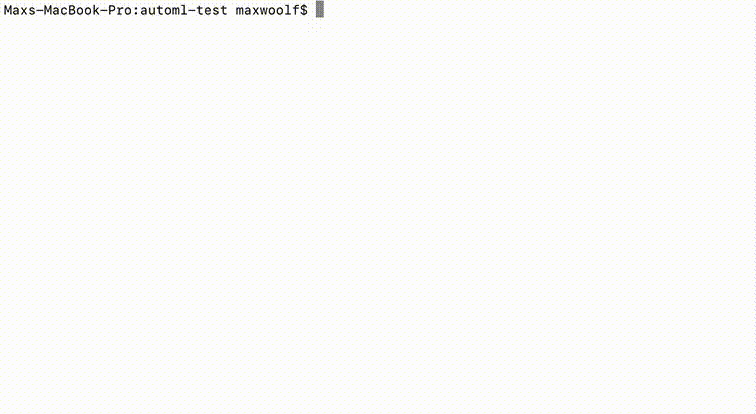
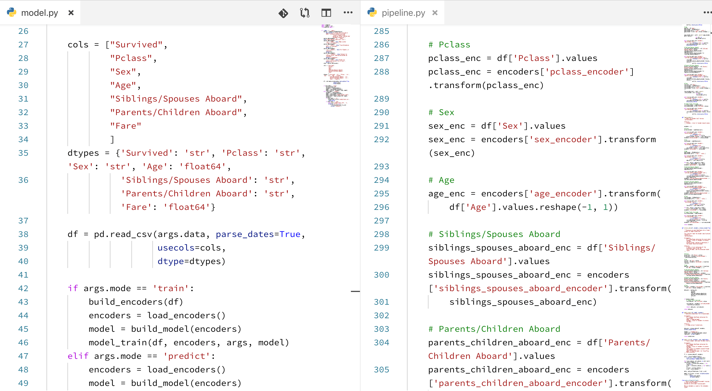

# automl-gs



Give an input CSV file and a target field you want to predict to automl-gs, and get a trained high-performing machine learning or deep learning model plus native Python code pipelines allowing you to integrate that model into any prediction workflow. No black box: you can see *exactly* how the data is processed, how the model is constructed, and you can make tweaks as necessary.



automl-gs is an AutoML tool which, unlike Microsoft's [NNI](https://github.com/Microsoft/nni), Uber's [Ludwig](https://github.com/uber/ludwig), and [TPOT](https://github.com/EpistasisLab/tpot), offers a *zero code/model definition interface* to getting an optimized model and data transformation pipeline in multiple popular ML/DL frameworks, with minimal Python dependencies (pandas + scikit-learn + your framework of choice). automl-gs is designed for citizen data scientists and engineers without a deep statistical background under the philosophy that you don't need to know any modern data preprocessing and machine learning engineering techniques to create a powerful prediction workflow.

Nowadays, the cost of computing many different models and hyperparameters is much lower than the opportunity cost of an data scientist's time. automl-gs is a Python 3 module designed to abstract away the common approaches to transforming tabular data, architecting machine learning/deep learning models, and performing random hyperparameter searches to identify the best-performing model. This allows data scientists and researchers to better utilize their time on model performance optimization.

* Generates native Python code; no platform lock-in, and no need to use automl-gs after the model script is created.
* Train model configurations super-fast *for free* using a **TPU** and TensorFlow in Google Colaboratory. (in Beta: you can access the Colaboratory notebook [here](https://colab.research.google.com/drive/1sbF8cqnOsdzN9Bdt74eER5s_xXcdvatV)).
* Handles messy datasets that normally require manual intervention, such as datetime/categorical encoding and spaced/parenthesized column names.
* Each part of the generated model pipeline is its own function w/ docstrings, making it much easier to integrate into production workflows.
* Extremely detailed metrics reporting for every trial stored in a tidy CSV, allowing you to identify and visualize model strengths and weaknesses.
* Correct serialization of data pipeline encoders on disk (i.e. no pickled Python objects!)
* Retrain the generated model on new data without making any code/pipeline changes.
* Quit the hyperparameter search at any time, as the results are saved after each trial.
* Training progress bars with ETAs for both the overall experiment and per-epoch during the experiment.

The models generated by automl-gs are intended to give a very strong *baseline* for solving a given problem; they're not the end-all-be-all that often accompanies the AutoML hype, but the resulting code is easily tweakable to improve from the baseline.

You can view the hyperparameters and their values [here](automl_gs/hyperparameters.yml), and the metrics that can be optimized [here](automl_gs/metrics.yml). Some of the more controversial design decisions for the generated models are noted in [DESIGN.md](DESIGN.md).

## Framework Support

Currently automl-gs supports the generation of models for regression and classification problems using the following Python frameworks:

* TensorFlow (via `tf.keras`) | `tensorflow`
* XGBoost (w/ histogram binning) | `xgboost`

To be implemented:

* Catboost | `catboost`
* LightGBM | `lightgbm`

## How to Use

automl-gs can be installed [via pip](https://pypi.org/project/automl_gs/):

```shell
pip3 install automl_gs
```

You will also need to install the corresponding ML/DL framework (e.g. `tensorflow`/`tensorflow-gpu` for TensorFlow, `xgboost` for xgboost, etc.)

After that, you can run it directly from the command line. For example, with the [famous Titanic dataset](http://web.stanford.edu/class/archive/cs/cs109/cs109.1166/problem12.html):

```shell
automl_gs titanic.csv Survived
```

If you want to use a different framework or configure the training, you can do it with flags:

```shell
automl_gs titanic.csv Survived --framework xgboost --num_trials 1000
```

You may also invoke automl-gs directly from Python. (e.g. via a Jupyter Notebook)

```python
from automl_gs import automl_grid_search

automl_grid_search('titanic.csv', 'Survived')
```

The output of the automl-gs training is:

* A timestamped folder (e.g. `automl_tensorflow_20190317_020434`) with contains:
  * `model.py`: The generated model file.
  * `pipeline.py`: The generated pipeline file.
  * `requirements.txt`: The generated requirements file.
  * `/encoders`: A folder containing JSON-serialized encoder files
  * `/metadata`: A folder containing training statistics + other cool stuff not yet implemented!
  * The model itself (format depends on framework)
* `automl_results.csv`: A CSV containing the training results after each epoch and the hyperparameters used to train at that time.

Once the training is done, you can run the generated files from the command line within the generated folder above.

To predict:

```shell
python3 model.py -d data.csv -m predict
```

To retrain the model on new data:

```shell
python3 model.py -d data.csv -m train
```

## CLI Arguments/Function Parameters

You can view these at any time by running `automl_gs -h` in the command line.

* `csv_path`: Path to the CSV file (must be in the current directory) [Required]
* `target_field`: Target field to predict [Required]
* `target_metric`: Target metric to optimize [Default: Automatically determined depending on problem type]
* `framework`: Machine learning framework to use [Default: 'tensorflow']
* `model_name`: Name of the model (if you want to train models with different names) [Default: 'automl']
* `num_trials`: Number of trials / different hyperparameter combos to test. [Default: 100]
* `split`: Train-validation split when training the models [Default: 0.7]
* `num_epochs`: Number of epochs / passes through the data when training the models. [Default: 20]
* `col_types`: Dictionary of fields:data types to use to override automl-gs's guesses. (only when using in Python) [Default: {}]
* `gpu`: For non-Tensorflow frameworks and Pascal-or-later GPUs, boolean to determine whether to use GPU-optimized training methods (TensorFlow can detect it automatically) [Default: False]
* `tpu_address`: For TensorFlow, hardware address of the TPU on the system. [Default: None]

## Examples


For a quick Hello World on how to use automl-gs, see [this Jupyter Notebook](docs/automl_gs_tutorial.ipynb).

Due to the size of some examples w/ generated code and accompanying data visualizations, they are maintained in a [separate repository](https://github.com/minimaxir/automl-gs-examples). (and also explain why there are two distinct "levels" in the example viz above!)

## How automl-gs Works

TL;DR: auto-ml gs generates raw Python code using Jinja templates and trains a model using the generated code in a subprocess: repeat using different hyperparameters until done and save the best model.

automl-gs loads a given CSV and infers the data type of each column to be fed into the model. Then it tries a ETL strategy for each column field as determined by the hyperparameters; for example, a Datetime field has its `hour` and `dayofweek` binary-encoded by default, but hyperparameters may dictate the encoding of `month` and `year` as additional model fields. ETL strategies are optimized for frameworks; TensorFlow for example will use text embeddings, while other frameworks will use CountVectorizers to encode text (when training, TensorFlow will also used a shared text encoder via Keras's functional API). automl-gs then creates a statistical model with the specified framework. Both the model ETL functions and model construction functions are saved as a generated Python script.

automl-gs then runs the generated training script as if it was a typical user. Once the model is trained, automl-gs saves the training results in its own CSV, along with all the hyperparameters used to train the model. automl-gs then repeats the task with another set of hyperparameters, until the specified number of trials is hit or the user kills the script.

The best model Python script is kept after each trial, which can then easily be integrated into other scripts, or run directly to get the prediction results on a new dataset.

## Helpful Notes

* *It is the user's responsibility to ensure the input dataset is high-quality.* No model hyperparameter search will provide good research on flawed/unbalanced datasets. Relatedly, hyperparameter optimization may provide optimistic predictions on the validation set, which may not necessarily match the model performance in the real world.
* *A neural network approach alone may not necessarily be the best approach*. Try using `xgboost`. The results may surprise you!
* *automl-gs is only attempting to solve tabular data problems.* If you have a more complicated problem to solve (e.g. predicting a sequence of outputs), I recommend using Microsoft's [NNI](https://github.com/Microsoft/nni) and Uber's [Ludwig](https://github.com/uber/ludwig) as noted in the introduction.

## Known Issues

* Issues when using Anaconda ([#8](https://github.com/minimaxir/automl-gs/issues/8)). Use an installed Python is possible.
* Issues when using Windows ([#13](https://github.com/minimaxir/automl-gs/issues/13))
* Issues when a field name in the input dataset starts with a number ([#18](https://github.com/minimaxir/automl-gs/issues/18))

## Future Work

Feature development will continue on automl-gs as long as there is interest in the package.

### Top Priority

* Add more frameworks
* Results visualization (via `plotnine`)
* Holiday support for datetimes
* Remove redundant generated code
* Native distributed/high level automation support (Polyaxon/Kubernetes, Airflow)
* Image field support (both as a CSV column field, and a special flow mode to take advantage of hyperparameter tuning)
* PyTorch model code generation.

### Elsework

* Generate script given an explicit set of hyperparameters
* More hyperparameters.
* Bayesian hyperparameter search for standalone version.
* Support for generating model code for R/Julia
* Tool for generating a Flask/Starlette REST API from a trained model script
* Allow passing an explicit, pre-defined test set CSV.

## Maintainer/Creator

Max Woolf ([@minimaxir](http://minimaxir.com))

*Max's open-source projects are supported by his [Patreon](https://www.patreon.com/minimaxir). If you found this project helpful, any monetary contributions to the Patreon are appreciated and will be put to good creative use.*

## License

MIT

The code generated by automl-gs is unlicensed; the owner of the generated code can decide the license.
